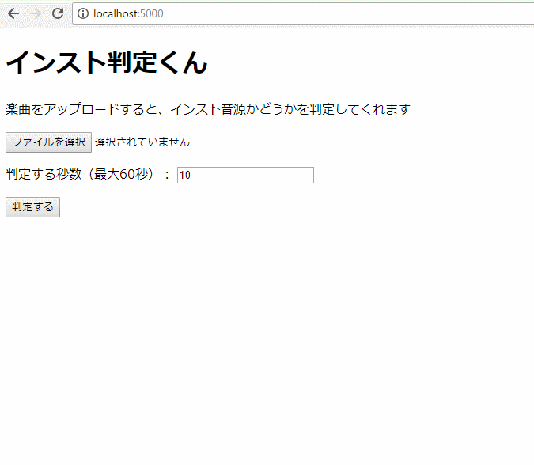

# インスト判定くん
楽曲をアップロードすると、インスト音源かどうかを判定してくれるwebサービス



## Development

```bash
# local development
cd functions/
yarn run tsc --watch
firebase serve --only functions

# deploy
cd functions
yarn build
cd ../
firebase deploy --only hosting,functions
```
